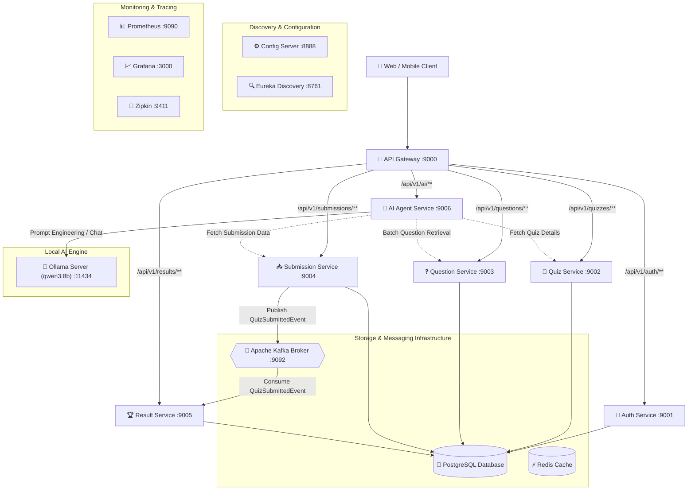
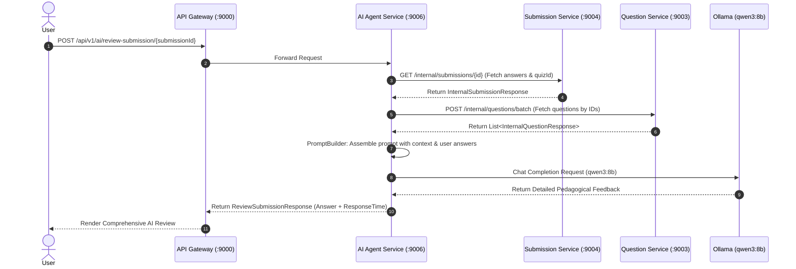

# 🧠 QuizHub Microservices

> **An enterprise-grade, event-driven, AI-orchestrated Quiz & Assessment Platform built with Java 21, Spring Boot 3.5+, Spring Cloud, Apache Kafka, and Local LLM (Spring AI + Ollama).**

---

[](https://www.oracle.com/java/)
[](https://spring.io/projects/spring-boot)
[](https://spring.io/projects/spring-cloud)
[](https://spring.io/projects/spring-ai)
[](https://kafka.apache.org/)
[](https://www.postgresql.org/)
[](https://www.docker.com/)

---

## 📑 Table of Contents

- [Overview](#-overview)
- [System Architecture](#-system-architecture)
- [Sprint Progress & Milestones](#-sprint-progress--milestones)
  - [Sprint 1: Infrastructure](#sprint-1--infrastructure-)
  - [Sprint 2: Authentication Service](#sprint-2--authentication-service-)
  - [Sprint 3: Quiz Service](#sprint-3--quiz-service-)
  - [Sprint 4: Question Service](#sprint-4--question-service-)
  - [Sprint 5: Submission Service](#sprint-5--submission-service-)
  - [Sprint 6: Result Service + Kafka](#sprint-6--result-service--kafka-)
  - [Sprint 7: AI Agent (Spring AI + Ollama)](#sprint-7--ai-agent--in-progress)
- [Microservice Ecosystem & Port Matrix](#-microservice-ecosystem--port-matrix)
- [AI Orchestration & LLM Workflows](#-ai-orchestration--llm-workflows)
- [Event-Driven Architecture (Kafka)](#-event-driven-architecture-kafka)
- [Key API Endpoints](#-key-api-endpoints)
- [Getting Started & Local Setup](#-getting-started--local-setup)
- [Monitoring & Observability](#-monitoring--observability)

---

## 🌟 Overview

**QuizHub** is a scalable, cloud-native microservices platform engineered for real-time quiz creation, question bank management, automated answer evaluation, event-driven scoring, and AI-powered educational analysis.

### Key Capabilities:
- **Centralized Configuration & Service Discovery:** Spring Cloud Config Server backed by Git/local repositories and Eureka Discovery for dynamic service registration.
- **Unified API Gateway:** Single-entry routing with Spring Cloud Gateway WebMVC, JWT token validation, and rate limiting.
- **Asynchronous Event-Driven Scoring:** Decoupled quiz submission pipeline leveraging Apache Kafka for real-time leaderboard generation and result compilation.
- **Local AI Agent Integration:** Deep integration with Spring AI and local Ollama (`qwen3:8b`) for question explanation, smart hint generation, difficulty/mistake analysis, and comprehensive submission review.
- **Full Observability:** Distributed tracing with Zipkin, metrics scraping with Prometheus, and dashboards via Grafana.

---

## 🏛 System Architecture



---

## 🚀 Sprint Progress & Milestones

| Sprint | Module | Status | Highlights |
|---|---|:---:|---|
| **Sprint 1** | **Infrastructure & Platform** | ✅ Complete | Multi-module Maven, Java 21, Docker Compose, Spring Cloud, Monitoring |
| **Sprint 2** | **Authentication Service** | ✅ Complete | JWT Auth, Register, Login, RBAC, User/Role Entities |
| **Sprint 3** | **Quiz Service** | ✅ Complete | Quiz CRUD, Lifecycle States (Publish/Archive), Internal Validation APIs |
| **Sprint 4** | **Question Service** | ✅ Complete | Question CRUD, Activation/Deactivation, Internal Batch Endpoint |
| **Sprint 5** | **Submission Service** | ✅ Complete | Quiz Session Initiation, Answer Evaluation, Kafka `QuizSubmittedEvent` |
| **Sprint 6** | **Result Service + Kafka** | ✅ Complete | Kafka Consumer, Scoring, Leaderboard, Producer/Consumer Deserialization Fixes |
| **Sprint 7** | **AI Agent (Spring AI + Ollama)** | 🚧 In Progress | Question Explain, Hints, Diagnostic Analysis, AI Submission Review Pipeline |

---

### Sprint 1 — Infrastructure ✅
- **1.1 Parent Project:**
  - Multi-module Maven setup with centralized dependency management.
  - Parent POM with Java 21 baseline and Spring Boot 3.5.x.
- **1.2 Docker Ecosystem:**
  - Automated provisioning of PostgreSQL, Redis, Apache Kafka, Zookeeper, Zipkin, Prometheus, and Grafana.
- **1.3 Spring Cloud Core:**
  - **Config Server (8888):** Centralized external configuration repository.
  - **Eureka Discovery Server (8761):** Dynamic service discovery and health monitoring.
  - **API Gateway (9000):** Unified routing, path predicates, and security boundary.
- **1.4 Observability & Monitoring:**
  - Spring Boot Actuator, Micrometer Prometheus metrics scraper, and Zipkin distributed tracing integration.

---

### Sprint 2 — Authentication Service ✅
- **2.1 Security:**
  - Stateless JWT token generation, parsing, and signing.
- **2.2 User Management:**
  - User registration, authentication, and role-based access control (RBAC).
- **2.3 Persistence:**
  - `User` entity and `Role` entity mapped with Spring Data JPA & PostgreSQL.
- **2.4 REST APIs:**
  - `POST /api/v1/auth/register` — User signup.
  - `POST /api/v1/auth/login` — User authentication & JWT issuance.
  - `GET /api/v1/auth/me` — Current authenticated user profile.

---

### Sprint 3 — Quiz Service ✅
- **3.1 Quiz Lifecycle Management:**
  - Create, read, update, and soft/hard delete quizzes.
- **3.2 Quiz State Machine:**
  - Transitions: Draft ➔ Published ➔ Archived.
- **3.3 Inter-Service Internal APIs:**
  - `GET /internal/quizzes/{id}/exists` — Quick existence check.
  - `GET /internal/quizzes/{id}/verify-owner` — Ownership validation for authoring.
  - Internal Quiz DTO exchange for client services.

---

### Sprint 4 — Question Service ✅
- **4.1 Question CRUD:**
  - Create, read, update, and remove questions with multiple choices, explanations, and scoring weights.
- **4.2 Question States:**
  - Activate and deactivate questions dynamically within question banks.
- **4.3 Internal APIs:**
  - Single question retrieval and bulk retrieval by Quiz ID.
- **4.4 AI Orchestration Support:**
  - **Batch Question Endpoint:** `POST /internal/questions/batch` — Bulk retrieval of question details to power AI review and prompt generation without repetitive network round-trips.

---

### Sprint 5 — Submission Service ✅
- **5.1 Quiz Submission Engine:**
  - Start quiz session and submit answers.
- **5.2 Evaluation Pipeline:**
  - Answer matching, score calculation, and percentage computation.
- **5.3 Persistence:**
  - `Submission` and `SubmissionAnswer` entities capturing timestamp, duration, raw answers, and calculated scores.
- **5.4 Event-Driven Kafka Publisher:**
  - Publishes `QuizSubmittedEvent` to Kafka topic `quiz-submissions` upon submission completion.

---

### Sprint 6 — Result Service + Kafka ✅
- **6.1 Kafka Consumer:**
  - Reliable consumption of `QuizSubmittedEvent` from the `quiz-submissions` topic.
- **6.2 Result Processing & Generation:**
  - Computes final grades, pass/fail status, percentiles, and persists results.
- **6.3 Public Result APIs:**
  - `GET /api/v1/results/{id}` — Individual result breakdown.
  - `GET /api/v1/results/quiz/{quizId}/leaderboard` — Real-time quiz leaderboard.
  - `GET /api/v1/results/my-results` — User historical test scores.
- **6.4 Kafka Infrastructure Resolution:**
  - ✅ Kafka topic creation & auto-provisioning.
  - ✅ Producer / Consumer configuration tuning.
  - ✅ Spring Kafka Type Header resolution (`__TypeId__` mapping).
  - ✅ Robust JSON deserialization & ErrorHandlingDeserializer.
  - ✅ Result persistence idempotency.

---

### Sprint 7 — AI Agent 🚧 (In Progress)

Empowering students and quiz creators with on-demand AI tutoring, automated hints, diagnostic analysis, and holistic submission reviews using local LLMs.



#### Sprint 7 Milestones:
- **Sprint 7.1 — AI Infrastructure ✅**
  - Spring AI starter integration.
  - Local Ollama connection configuration (`http://localhost:11434`).
  - Model selection: `qwen3:8b` (Temperature: 0.7).
  - `LLMService` client abstraction with unified prompt handling.
- **Sprint 7.2 — Explain Question ✅**
  - `POST /api/v1/ai/explain-question/{id}` — Generates comprehensive conceptual explanations and answers reasoning for any question.
- **Sprint 7.3 — Hint Generation ✅**
  - `POST /api/v1/ai/hint-question/{id}` — Generates progressive, non-spoiler hints to assist learners during quiz attempts.
- **Sprint 7.4 — Question Analysis ✅**
  - `POST /api/v1/ai/analyze-question/{id}` — Structured analysis returning JSON with:
    - **Difficulty Level** (Beginner, Intermediate, Advanced)
    - **Core Concepts** tested
    - **Common Mistakes & Pitfalls**
    - **Recommended Learning Topics**
- **Sprint 7.5 — Batch Question Retrieval ✅**
  - Implemented `POST /internal/questions/batch` on Question Service for bulk fetching.
- **Sprint 7.6 — AI Submission Review ✅**
  - `POST /api/v1/ai/review-submission/{submissionId}`
  - End-to-end orchestration: Fetches submission ➔ Batch question lookup ➔ Builds rich pedagogical prompt ➔ Obtains deep review and recommendations from `qwen3:8b`.

---

## 🔌 Microservice Ecosystem & Port Matrix

| Service | Port | Database / Broker | Description |
|---|:---:|---|---|
| **Config Server** | `8888` | Local / Git Repo | Centralized cloud configuration management |
| **Discovery Server** | `8761` | In-Memory (Eureka) | Service registry and health heartbeat |
| **API Gateway** | `9000` | — | Reverse proxy, dynamic routing, security gateway |
| **Auth Service** | `9001` | PostgreSQL (`quizhub_auth`) | User authentication, registration, JWT issuance |
| **Quiz Service** | `9002` | PostgreSQL (`quizhub_quiz`) | Quiz authoring, publishing, and lifecycle management |
| **Question Service** | `9003` | PostgreSQL (`quizhub_question`) | Question bank management and batch AI lookups |
| **Submission Service** | `9004` | PostgreSQL (`quizhub_submission`), Kafka | Quiz attempts, real-time evaluation, event publishing |
| **Result Service** | `9005` | PostgreSQL (`quizhub_result`), Kafka | Result generation, leaderboards, Kafka consumer |
| **AI Agent Service** | `9006` | Ollama (`qwen3:8b`) | AI explanations, hints, analysis, submission reviews |
| **Kafka Broker** | `9092` | Zookeeper (`2181`) | Distributed event streaming broker |
| **Zipkin** | `9411` | In-Memory | Distributed request tracing |
| **Prometheus** | `9090` | Time Series TSDB | Metrics aggregation and monitoring |
| **Grafana** | `3000` | Internal DB | Metric visualization and operational dashboards |

---

## 📡 Key API Endpoints

### 🔐 Authentication Service (`/api/v1/auth`)
| Method | Endpoint | Description |
|---|---|---|
| `POST` | `/api/v1/auth/register` | Register a new user account |
| `POST` | `/api/v1/auth/login` | Login and receive a JWT access token |
| `GET` | `/api/v1/auth/me` | Fetch current authenticated user details |

### 📝 Quiz Service (`/api/v1/quizzes`)
| Method | Endpoint | Description |
|---|---|---|
| `POST` | `/api/v1/quizzes` | Create a new quiz |
| `GET` | `/api/v1/quizzes/{id}` | Get quiz details by ID |
| `PUT` | `/api/v1/quizzes/{id}` | Update quiz metadata |
| `DELETE` | `/api/v1/quizzes/{id}` | Delete a quiz |
| `PATCH` | `/api/v1/quizzes/{id}/publish` | Publish quiz for learners |
| `PATCH` | `/api/v1/quizzes/{id}/archive` | Archive an active quiz |

### ❓ Question Service (`/api/v1/questions` & `/internal/questions`)
| Method | Endpoint | Description |
|---|---|---|
| `POST` | `/api/v1/questions` | Create a new question |
| `GET` | `/api/v1/questions/{id}` | Get question by ID |
| `PUT` | `/api/v1/questions/{id}` | Update question |
| `DELETE` | `/api/v1/questions/{id}` | Delete question |
| `POST` | `/internal/questions/batch` | *(Internal)* Fetch questions by list of IDs |

### 📥 Submission Service (`/api/v1/submissions`)
| Method | Endpoint | Description |
|---|---|---|
| `POST` | `/api/v1/submissions/start` | Start a new quiz attempt session |
| `POST` | `/api/v1/submissions/submit` | Submit answers, evaluate score, trigger Kafka event |

### 🏆 Result Service (`/api/v1/results`)
| Method | Endpoint | Description |
|---|---|---|
| `GET` | `/api/v1/results/{id}` | Get detailed quiz result |
| `GET` | `/api/v1/results/quiz/{quizId}/leaderboard` | View quiz leaderboard |
| `GET` | `/api/v1/results/my-results` | View current user's past quiz results |

### 🤖 AI Agent Service (`/api/v1/ai`)
| Method | Endpoint | Description |
|---|---|---|
| `POST` | `/api/v1/ai/explain-question/{id}` | Generate an in-depth pedagogical explanation |
| `POST` | `/api/v1/ai/hint-question/{id}` | Generate a progressive hint without revealing the answer |
| `POST` | `/api/v1/ai/analyze-question/{id}` | Diagnostic breakdown (difficulty, concepts, mistakes, recommendations) |
| `POST` | `/api/v1/ai/review-submission/{id}` | End-to-end AI review of completed student submission |

---

## 🛠 Getting Started & Local Setup

### 1. Prerequisites
- **JDK 21** or later
- **Maven 3.9+**
- **Docker & Docker Compose**
- **Ollama** installed locally ([ollama.ai](https://ollama.ai))

### 2. Pull the AI Model
```bash
ollama pull qwen3:8b
```

### 3. Start Supporting Infrastructure
Run Docker Compose to spin up PostgreSQL, Redis, Kafka, Zookeeper, Prometheus, Grafana, and Zipkin:
```bash
cd docker/compose
docker compose up -d
```

### 4. Build the Project
From the repository root:
```bash
mvn clean install -DskipTests
```

### 5. Start Microservices in Order
To ensure proper configuration and service registration, launch microservices in the following sequence:

1. **Config Server:** `backend/config-server` (Port `8888`)
2. **Discovery Server:** `backend/discovery-server` (Port `8761`)
3. **API Gateway:** `backend/api-gateway` (Port `9000`)
4. **Domain Services (can be started in parallel):**
   - `auth-service` (Port `9001`)
   - `quiz-service` (Port `9002`)
   - `question-service` (Port `9003`)
   - `submission-service` (Port `9004`)
   - `result-service` (Port `9005`)
   - `ai-agent-service` (Port `9006`)

---

## 📊 Monitoring & Observability

| Tool | URL | Credentials / Notes |
|---|---|---|
| **Eureka Dashboard** | [http://localhost:8761](http://localhost:8761) | Live view of registered service instances |
| **API Gateway** | [http://localhost:9000](http://localhost:9000) | Primary API ingress |
| **Prometheus** | [http://localhost:9090](http://localhost:9090) | Metrics scraping and query console |
| **Grafana** | [http://localhost:3000](http://localhost:3000) | `admin` / `admin` (Pre-configured QuizHub overview dashboard) |
| **Zipkin** | [http://localhost:9411](http://localhost:9411) | Distributed tracing UI |

---

## 📄 License
This project is licensed under the [MIT License](LICENSE).